## FlappyBird - 水管還沒接上去
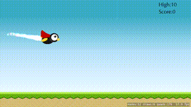

## SpaceBattle - SpriteKit初體驗
(參考出處： [(一)宇宙大戰 Space Battle — 新建場景Scene、精靈節點、Particle粒子及背景音樂 - ifiero](http://www.ifiero.com/index.php/archives/126))
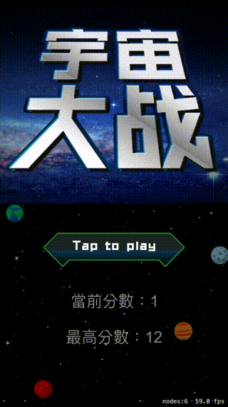

## SpriteKit_HelloWorld - 文字標籤
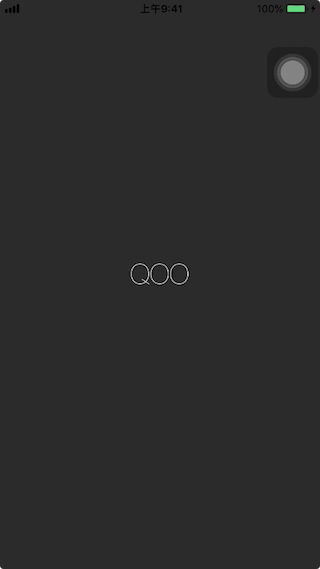

## SpriteKit_Camera - 利用Camera來製作場景無限捲動
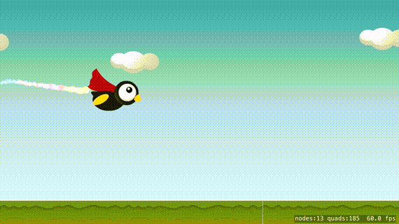

## SpriteKit_Move - 足球反彈

## Spritekit_UITouch - 物體移動
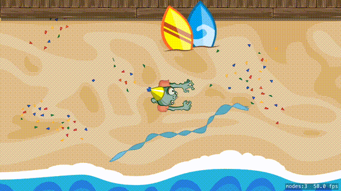

## Spritekit_UIGestureRecognizer - 手勢應用
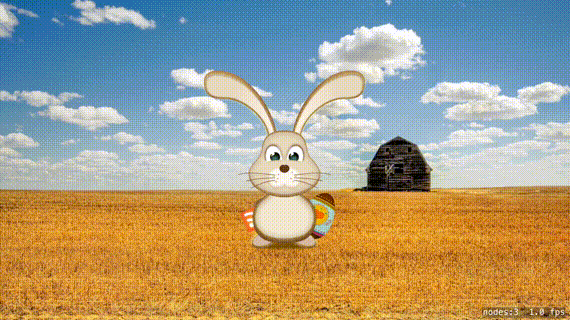

## SpriteKit_SKCropNode - 遮罩切圖
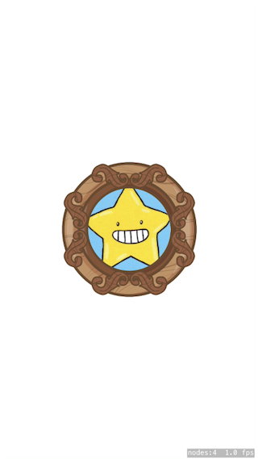

## SpriteKit_SKPhysicsBody - 標籤因重力落下
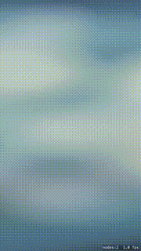

## SpriteKit_PhysicsBounds - 方塊因重力落下而停住

## SpriteKit_RepeatNodes - 一堆小球落下

## SpriteKit_NodeMove - 踢(拉)足球
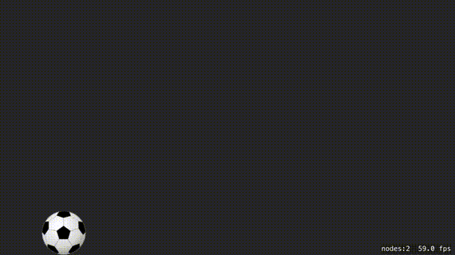

## SpriteKit_ApplyImpulse - 彈力球
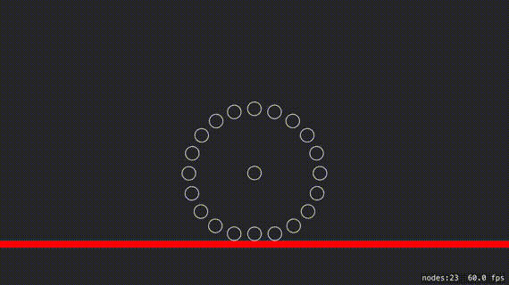

## SpriteKit_ContactDelegate - 物體撞擊
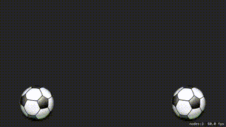

## SpriteKit_TileMap - 產生2D地圖
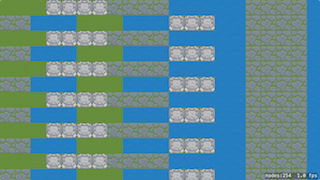

## SpriteKit_TexturePacker - 使用工具產生地圖
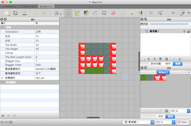

